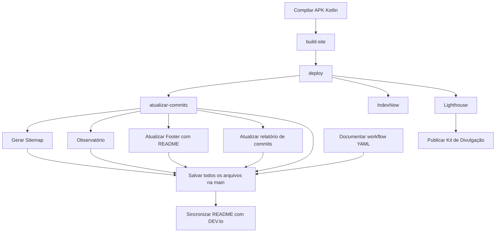

# Documentação do workflow — Mulher Amparada

- **Arquivo de origem:** `.github/workflows/automations.yml`
- **Arquivo gerado:** `.github/workflows/workflow.md`
- **Jobs identificados:** 14
- **Etapas identificadas:** 58

## Tabela completa de jobs e etapas

| ID do job | Nome | Runner | Dependências | Etapas |
|---|---|---|---|---|
| `build` | Compilar APK Kotlin | ubuntu-24.04 | Nenhuma | 1. Baixar código (`actions/checkout@v6`); 2. Verificar projeto — executa comandos; 3. Configurar Java 17 (`actions/setup-java@v6`); 4. Verificar Android SDK 37 — executa comandos; 5. Dar permissão ao Gradle — executa comandos; 6. Compilar APK — executa comandos; 7. Localizar APK — executa comandos; 8. Assinar APK — executa comandos; 9. Preparar APK da Release — executa comandos; 10. APK-Kotlin-Assinado (`actions/upload-artifact@v6`); 11. Calcular tamanho real do APK — executa comandos; 12. Calcular SHA-256 — executa comandos; 13. Atualizar APK no main — executa comandos; 14. Verificar Release — executa comandos; 15. Excluir APK antigo da Release — executa comandos; 16. Enviar APK para a Release — executa comandos; 17. Atualizar SHA-256 da Release — executa comandos; 18. Atualizar link, tamanho e SHA-256 no download.html — executa comandos; 19. Enviar download.html atualizado para o main — executa comandos; 20. Mostrar resumo — executa comandos |
| `build-site` | build-site | ubuntu-24.04 | `build` | 1. Checkout (`actions/checkout@v6`); 2. Setup Pages (`actions/configure-pages@v6`); 3. Build with Jekyll (`actions/jekyll-build-pages@v1`); 4. Upload Pages artifact (`actions/upload-pages-artifact@v5`) |
| `deploy` | deploy | ubuntu-24.04 | `build-site` | 1. Deploy to GitHub Pages (`actions/deploy-pages@v5`) |
| `atualizar-commits` | atualizar-commits | ubuntu-24.04 | `deploy` | 1. Baixar todo o histórico (`actions/checkout@v6`); 2. Atualizar total de commits — executa comandos; 3. arquivo-readme (`actions/upload-artifact@v6`) |
| `sincronizar-devto` | Sincronizar README com DEV.to | ubuntu-24.04 | `salvar-na-main` | 1. Baixar código atualizado (`actions/checkout@v6`); 2. Atualizar artigo no DEV.to — executa comandos |
| `sitemap` | Gerar Sitemap | ubuntu-24.04 | `atualizar-commits` | 1. Checkout (`actions/checkout@v6`); 2. Gerar Sitemap (`cicirello/generate-sitemap@v1`); 3. arquivo-sitemap (`actions/upload-artifact@v6`) |
| `indexnow` | IndexNow | ubuntu-24.04 | `deploy` | 1. Enviar Sitemap ao IndexNow (`bojieyang/indexnow-action@v3`) |
| `lighthouse` | Lighthouse | ubuntu-24.04 | `deploy` | 1. Lighthouse (`treosh/lighthouse-ci-action@v12`) |
| `publicar-divulgacao` | Publicar Kit de Divulgação | ubuntu-24.04 | `lighthouse` | 1. Baixar repositório (`actions/checkout@v6`); 2. Configurar Node.js (`actions/setup-node@v6`); 3. Criar pacote de divulgação — executa comandos; 4. Kit de Divulgação (`softprops/action-gh-release@v3`) |
| `observatorio` | Observatório | ubuntu-24.04 | `atualizar-commits` | 1. Baixar repositório (`actions/checkout@v6`); 2. Instalar dependências do Observatório — executa comandos; 3. Compilar observatório — executa comandos; 4. Executar observatório — executa comandos; 5. Verificar mapa gerado — executa comandos; 6. observatorio (`actions/upload-artifact@v6`) |
| `atualizar-footer` | Atualizar Footer com README | ubuntu-24.04 | `atualizar-commits` | 1. Baixar repositório (`actions/checkout@v6`); 2. Instalar Python (`actions/setup-python@v6`); 3. Instalar dependência Python — executa comandos; 4. Atualizar footer com README — executa comandos; 5. arquivo-footer (`actions/upload-artifact@v6`) |
| `atualizar-relatorio-commits` | Atualizar relatório de commits | ubuntu-24.04 | `atualizar-commits` | 1. Baixar repositório (`actions/checkout@v6`); 2. Instalar Ruby (`ruby/setup-ruby@v1`); 3. Gerar relatório de commits — executa comandos; 4. arquivos-relatorio-commits (`actions/upload-artifact@v6`) |
| `pesquisar-projeto` | Documentar workflow YAML | ubuntu-24.04 | Nenhuma | 1. Baixar repositório (`actions/checkout@v6`); 2. Instalar PHP — executa comandos; 3. Gerar documentação do workflow — executa comandos; 4. arquivos-pesquisas (`actions/upload-artifact@v6`) |
| `salvar-na-main` | Salvar todos os arquivos na main | ubuntu-24.04 | `atualizar-commits`, `sitemap`, `atualizar-footer`, `atualizar-relatorio-commits`, `pesquisar-projeto`, `observatorio` | Nenhuma identificada |

## Grafo completo de dependências

As setas representam as dependências declaradas em `needs` no YAML original.



## Detalhamento dos jobs

### Compilar APK Kotlin

- **ID:** `build`
- **Runner:** `ubuntu-24.04`
- **Dependências:** Nenhuma

| # | Etapa | Ação | Execução |
|---:|---|---|---|
| 1 | Baixar código | `actions/checkout@v6` | — |
| 2 | Verificar projeto | — | \| |
| 3 | Configurar Java 17 | `actions/setup-java@v6` | — |
| 4 | Verificar Android SDK 37 | — | \| |
| 5 | Dar permissão ao Gradle | — | chmod +x gradlew |
| 6 | Compilar APK | — | \| |
| 7 | Localizar APK | — | \| |
| 8 | Assinar APK | — | \| |
| 9 | Preparar APK da Release | — | \| |
| 10 | APK-Kotlin-Assinado | `actions/upload-artifact@v6` | — |
| 11 | Calcular tamanho real do APK | — | \| |
| 12 | Calcular SHA-256 | — | \| |
| 13 | Atualizar APK no main | — | \| |
| 14 | Verificar Release | — | \| |
| 15 | Excluir APK antigo da Release | — | \| |
| 16 | Enviar APK para a Release | — | \| |
| 17 | Atualizar SHA-256 da Release | — | \| |
| 18 | Atualizar link, tamanho e SHA-256 no download.html | — | \| |
| 19 | Enviar download.html atualizado para o main | — | \| |
| 20 | Mostrar resumo | — | \| |

### build-site

- **ID:** `build-site`
- **Runner:** `ubuntu-24.04`
- **Dependências:** `build`

| # | Etapa | Ação | Execução |
|---:|---|---|---|
| 1 | Checkout | `actions/checkout@v6` | — |
| 2 | Setup Pages | `actions/configure-pages@v6` | — |
| 3 | Build with Jekyll | `actions/jekyll-build-pages@v1` | — |
| 4 | Upload Pages artifact | `actions/upload-pages-artifact@v5` | — |

### deploy

- **ID:** `deploy`
- **Runner:** `ubuntu-24.04`
- **Dependências:** `build-site`

| # | Etapa | Ação | Execução |
|---:|---|---|---|
| 1 | Deploy to GitHub Pages | `actions/deploy-pages@v5` | — |

### atualizar-commits

- **ID:** `atualizar-commits`
- **Runner:** `ubuntu-24.04`
- **Dependências:** `deploy`

| # | Etapa | Ação | Execução |
|---:|---|---|---|
| 1 | Baixar todo o histórico | `actions/checkout@v6` | — |
| 2 | Atualizar total de commits | — | \| |
| 3 | arquivo-readme | `actions/upload-artifact@v6` | — |

### Sincronizar README com DEV.to

- **ID:** `sincronizar-devto`
- **Runner:** `ubuntu-24.04`
- **Dependências:** `salvar-na-main`

| # | Etapa | Ação | Execução |
|---:|---|---|---|
| 1 | Baixar código atualizado | `actions/checkout@v6` | — |
| 2 | Atualizar artigo no DEV.to | — | \| |

### Gerar Sitemap

- **ID:** `sitemap`
- **Runner:** `ubuntu-24.04`
- **Dependências:** `atualizar-commits`

| # | Etapa | Ação | Execução |
|---:|---|---|---|
| 1 | Checkout | `actions/checkout@v6` | — |
| 2 | Gerar Sitemap | `cicirello/generate-sitemap@v1` | — |
| 3 | arquivo-sitemap | `actions/upload-artifact@v6` | — |

### IndexNow

- **ID:** `indexnow`
- **Runner:** `ubuntu-24.04`
- **Dependências:** `deploy`

| # | Etapa | Ação | Execução |
|---:|---|---|---|
| 1 | Enviar Sitemap ao IndexNow | `bojieyang/indexnow-action@v3` | — |

### Lighthouse

- **ID:** `lighthouse`
- **Runner:** `ubuntu-24.04`
- **Dependências:** `deploy`

| # | Etapa | Ação | Execução |
|---:|---|---|---|
| 1 | Lighthouse | `treosh/lighthouse-ci-action@v12` | — |

### Publicar Kit de Divulgação

- **ID:** `publicar-divulgacao`
- **Runner:** `ubuntu-24.04`
- **Dependências:** `lighthouse`

| # | Etapa | Ação | Execução |
|---:|---|---|---|
| 1 | Baixar repositório | `actions/checkout@v6` | — |
| 2 | Configurar Node.js | `actions/setup-node@v6` | — |
| 3 | Criar pacote de divulgação | — | npm pack |
| 4 | Kit de Divulgação | `softprops/action-gh-release@v3` | — |

### Observatório

- **ID:** `observatorio`
- **Runner:** `ubuntu-24.04`
- **Dependências:** `atualizar-commits`

| # | Etapa | Ação | Execução |
|---:|---|---|---|
| 1 | Baixar repositório | `actions/checkout@v6` | — |
| 2 | Instalar dependências do Observatório | — | \| |
| 3 | Compilar observatório | — | \| |
| 4 | Executar observatório | — | \| |
| 5 | Verificar mapa gerado | — | \| |
| 6 | observatorio | `actions/upload-artifact@v6` | — |

### Atualizar Footer com README

- **ID:** `atualizar-footer`
- **Runner:** `ubuntu-24.04`
- **Dependências:** `atualizar-commits`

| # | Etapa | Ação | Execução |
|---:|---|---|---|
| 1 | Baixar repositório | `actions/checkout@v6` | — |
| 2 | Instalar Python | `actions/setup-python@v6` | — |
| 3 | Instalar dependência Python | — | pip install Markdown |
| 4 | Atualizar footer com README | — | python3 scripts/atualizar_footer.py |
| 5 | arquivo-footer | `actions/upload-artifact@v6` | — |

### Atualizar relatório de commits

- **ID:** `atualizar-relatorio-commits`
- **Runner:** `ubuntu-24.04`
- **Dependências:** `atualizar-commits`

| # | Etapa | Ação | Execução |
|---:|---|---|---|
| 1 | Baixar repositório | `actions/checkout@v6` | — |
| 2 | Instalar Ruby | `ruby/setup-ruby@v1` | — |
| 3 | Gerar relatório de commits | — | ruby scripts/commits.rb |
| 4 | arquivos-relatorio-commits | `actions/upload-artifact@v6` | — |

### Documentar workflow YAML

- **ID:** `pesquisar-projeto`
- **Runner:** `ubuntu-24.04`
- **Dependências:** Nenhuma

| # | Etapa | Ação | Execução |
|---:|---|---|---|
| 1 | Baixar repositório | `actions/checkout@v6` | — |
| 2 | Instalar PHP | — | \| |
| 3 | Gerar documentação do workflow | — | \| |
| 4 | arquivos-pesquisas | `actions/upload-artifact@v6` | — |

### Salvar todos os arquivos na main

- **ID:** `salvar-na-main`
- **Runner:** `ubuntu-24.04`
- **Dependências:** `atualizar-commits`, `sitemap`, `atualizar-footer`, `atualizar-relatorio-commits`, `pesquisar-projeto`, `observatorio`

| # | Etapa | Ação | Execução |
|---:|---|---|---|
| — | Nenhuma etapa identificada | — | — |

## YAML original completo

O bloco abaixo reproduz o conteúdo original do arquivo `automations.yml`, preservando comandos, condições, variáveis, comentários e configurações.

````yaml
name: Automações do Mulher Amparada

on:
  push:
    branches:
      - '**'

  workflow_dispatch:


permissions:
  contents: write
  pages: write
  id-token: write
  actions: read

concurrency:
  group: ${{ github.workflow }}-${{ github.ref }}
  cancel-in-progress: ${{ github.event_name != 'workflow_dispatch' }}


jobs:

  # =========================================================
  # COMPILAR APK
  # =========================================================

  build:

    name: Compilar APK Kotlin

    runs-on: ubuntu-24.04

    env:
      App1_DIR: "Código-fonte do app = Mulher Amparada"
      RELEASE_TAG: "app"
      RELEASE_APK_NAME: "app-debug-assinado.apk"

    steps:

      # =========================================================
      # BAIXAR CÓDIGO
      # =========================================================

      - name: Baixar código
        uses: actions/checkout@v6
        with:
          fetch-depth: 1


      # =========================================================
      # VERIFICAR PROJETO
      # =========================================================

      - name: Verificar projeto
        run: |

          if [ ! -d "$App1_DIR" ]; then
            echo "ERRO: pasta não encontrada:"
            echo "$App1_DIR"
            exit 1
          fi

          if [ ! -f "$App1_DIR/gradlew" ]; then
            echo "ERRO: gradlew não encontrado."
            exit 1
          fi


      # =========================================================
      # JAVA
      # =========================================================

      - name: Configurar Java 17
        uses: actions/setup-java@v6
        with:
          distribution: temurin
          java-version: "17"
          cache: gradle


      # =========================================================
      # VERIFICAR ANDROID SDK 37
      # =========================================================

      - name: Verificar Android SDK 37
        run: |

          echo "ANDROID_HOME:"
          echo "$ANDROID_HOME"

          echo ""
          echo "Plataformas Android instaladas:"
          ls -la "$ANDROID_HOME/platforms"

          echo ""
          echo "Plataformas 37 disponíveis:"
          find "$ANDROID_HOME/platforms" \
            -maxdepth 1 \
            -type d \
            -name "android-37*"

          if ! find "$ANDROID_HOME/platforms" \
            -maxdepth 1 \
            -type d \
            -name "android-37*" \
            | grep -q .; then

            echo "ERRO: nenhuma plataforma Android 37 encontrada."
            exit 1
          fi


      # =========================================================
      # PERMISSÃO DO GRADLE
      # =========================================================

      - name: Dar permissão ao Gradle
        working-directory: ${{ env.App1_DIR }}
        run: chmod +x gradlew


      # =========================================================
      # COMPILAR APK
      # =========================================================

      - name: Compilar APK
        id: compilar_apk
        working-directory: ${{ env.App1_DIR }}
        run: |

          set -o pipefail

          ./gradlew assembleDebug --stacktrace 2>&1 \
            | tee "$GITHUB_WORKSPACE/gradle-build.log"

          STATUS=${PIPESTATUS[0]}

          if [ "$STATUS" -ne 0 ]; then

            {
              echo ""
              echo "# ❌ ERRO NA COMPILAÇÃO"
              echo ""
              echo "## 🔴 Etapa"
              echo ""
              echo "**Compilar APK**"
              echo ""
              echo "## 💥 O que aconteceu"
              echo ""
              echo "O Gradle não conseguiu compilar o APK."
              echo ""
              echo "## 📋 Erro do Gradle"
              echo ""
              echo '```text'
              tail -n 100 "$GITHUB_WORKSPACE/gradle-build.log"
              echo '```'
              echo ""
              echo "**Código de saída:** \`$STATUS\`"
            } >> "$GITHUB_STEP_SUMMARY"

            exit "$STATUS"
          fi


      # =========================================================
      # LOCALIZAR APK
      # =========================================================

      - name: Localizar APK
        id: apk
        working-directory: ${{ env.App1_DIR }}
        run: |

          APK=$(find app/build/outputs/apk/debug \
            -type f \
            -name "*.apk" \
            | head -n 1)

          if [ -z "$APK" ]; then
            echo "ERRO: APK não encontrado."
            exit 1
          fi

          echo "APK encontrado:"
          echo "$APK"

          echo "apk=$APK" >> "$GITHUB_OUTPUT"


      # =========================================================
      # ASSINAR APK
      # =========================================================

      - name: Assinar APK
        working-directory: ${{ env.App1_DIR }}
        env:
          KEYSTORE_BASE64: ${{ secrets.KEYSTORE_BASE64 }}
          KEYSTORE_PASSWORD: ${{ secrets.KEYSTORE_PASSWORD }}
          KEY_ALIAS: ${{ secrets.KEY_ALIAS }}
          KEY_PASSWORD: ${{ secrets.KEY_PASSWORD }}
        run: |

          if [ -z "$KEYSTORE_BASE64" ]; then
            echo "ERRO: KEYSTORE_BASE64 não configurado."
            exit 1
          fi

          if [ -z "$KEYSTORE_PASSWORD" ]; then
            echo "ERRO: KEYSTORE_PASSWORD não configurado."
            exit 1
          fi

          if [ -z "$KEY_ALIAS" ]; then
            echo "ERRO: KEY_ALIAS não configurado."
            exit 1
          fi

          if [ -z "$KEY_PASSWORD" ]; then
            echo "ERRO: KEY_PASSWORD não configurado."
            exit 1
          fi

          echo "$KEYSTORE_BASE64" | base64 --decode > mulher-amparada.jks

          APK="${{ steps.apk.outputs.apk }}"

          if [ ! -f "$APK" ]; then
            echo "ERRO: APK não encontrado:"
            echo "$APK"
            rm -f mulher-amparada.jks
            exit 1
          fi

          APKSIGNER=$(find "$ANDROID_HOME/build-tools" \
            -type f \
            -name "apksigner" \
            | sort -V \
            | tail -n 1)

          if [ -z "$APKSIGNER" ]; then
            echo "ERRO: apksigner não encontrado."
            rm -f mulher-amparada.jks
            exit 1
          fi

          echo "Assinando APK..."

          "$APKSIGNER" sign \
            --ks mulher-amparada.jks \
            --ks-key-alias "$KEY_ALIAS" \
            --ks-pass "pass:$KEYSTORE_PASSWORD" \
            --key-pass "pass:$KEY_PASSWORD" \
            --out app-assinado.apk \
            "$APK"

          mv app-assinado.apk "$APK"

          echo "Verificando assinatura..."

          "$APKSIGNER" verify \
            --verbose \
            "$APK"

          rm -f mulher-amparada.jks

          echo "APK assinado e verificado com sucesso."


      # =========================================================
      # PREPARAR APK DA RELEASE
      # =========================================================

      - name: Preparar APK da Release
        working-directory: ${{ env.App1_DIR }}
        run: |

          APK="${{ steps.apk.outputs.apk }}"

          cp "$APK" "$GITHUB_WORKSPACE/$RELEASE_APK_NAME"

          echo "APK preparado:"
          echo "$GITHUB_WORKSPACE/$RELEASE_APK_NAME"


      # =========================================================
      # ARTIFACT
      # =========================================================

      - name: Enviar APK como artifact
        uses: actions/upload-artifact@v6
        with:
          name: APK-Kotlin-Assinado
          path: "${{ github.workspace }}/${{ env.RELEASE_APK_NAME }}"
          if-no-files-found: error


      # =========================================================
      # TAMANHO REAL
      # =========================================================

      - name: Calcular tamanho real do APK
        id: apk_size
        run: |

          APK="$GITHUB_WORKSPACE/$RELEASE_APK_NAME"

          if [ ! -f "$APK" ]; then
            echo "ERRO: APK não encontrado."
            exit 1
          fi

          BYTES=$(stat -c%s "$APK")

          SIZE_MB=$(awk "BEGIN {
            printf \"%.2f\", $BYTES / 1024 / 1024
          }")

          SIZE_FORMATADO="${SIZE_MB} MB"

          echo "========================================"
          echo "TAMANHO REAL DO APK ASSINADO"
          echo "========================================"
          echo "Arquivo: $APK"
          echo "Bytes: $BYTES"
          echo "MB: $SIZE_FORMATADO"
          echo "========================================"

          echo "bytes=$BYTES" >> "$GITHUB_OUTPUT"
          echo "size_mb=$SIZE_MB" >> "$GITHUB_OUTPUT"
          echo "size_formatado=$SIZE_FORMATADO" >> "$GITHUB_OUTPUT"


      # =========================================================
      # SHA-256
      # =========================================================

      - name: Calcular SHA-256
        id: sha256
        run: |

          APK="$GITHUB_WORKSPACE/$RELEASE_APK_NAME"

          if [ ! -f "$APK" ]; then
            echo "ERRO: APK não encontrado."
            exit 1
          fi

          SHA256=$(sha256sum "$APK" | awk '{print $1}')

          echo "SHA-256:"
          echo "$SHA256"

          echo "sha256=$SHA256" >> "$GITHUB_OUTPUT"


      # =========================================================
      # ATUALIZAR APK NO MAIN
      # =========================================================

      - name: Atualizar APK no main
        run: |

          git config user.name "github-actions[bot]"
          git config user.email "41898282+github-actions[bot]@users.noreply.github.com"

          TARGET="${App1_DIR}/app-release.apk"

          cp "$GITHUB_WORKSPACE/$RELEASE_APK_NAME" "$TARGET"

          git fetch origin main

          git reset --hard origin/main

          cp "$GITHUB_WORKSPACE/$RELEASE_APK_NAME" "$TARGET"

          git add "$TARGET"

          if git diff --cached --quiet; then
            echo "APK já está atualizado."
          else
            git commit -m "Atualizar APK assinado [skip ci]"
            git push origin main
          fi


      # =========================================================
      # VERIFICAR RELEASE
      # =========================================================

      - name: Verificar Release
        env:
          GH_TOKEN: ${{ github.token }}
        run: |

          if ! gh release view "$RELEASE_TAG" \
            --repo "$GITHUB_REPOSITORY" >/dev/null 2>&1; then

            echo "ERRO: A Release '$RELEASE_TAG' não existe."
            exit 1
          fi

          echo "Release encontrada."


      # =========================================================
      # EXCLUIR APK ANTIGO
      # =========================================================

      - name: Excluir APK antigo da Release
        env:
          GH_TOKEN: ${{ github.token }}
        run: |

          ASSET_ID=$(gh api \
            "repos/$GITHUB_REPOSITORY/releases/tags/$RELEASE_TAG" \
            --jq ".assets[] | select(.name == \"$RELEASE_APK_NAME\") | .id" \
            | head -n 1)

          if [ -n "$ASSET_ID" ]; then

            echo "Excluindo APK antigo..."

            gh api \
              --method DELETE \
              "repos/$GITHUB_REPOSITORY/releases/assets/$ASSET_ID"

            echo "APK antigo excluído."

          else

            echo "Nenhum APK antigo encontrado."

          fi


      # =========================================================
      # ENVIAR APK PARA RELEASE
      # =========================================================

      - name: Enviar APK para a Release
        env:
          GH_TOKEN: ${{ github.token }}
        run: |

          gh release upload \
            "$RELEASE_TAG" \
            "$GITHUB_WORKSPACE/$RELEASE_APK_NAME" \
            --repo "$GITHUB_REPOSITORY"

          echo "Novo APK enviado para a Release."


      # =========================================================
      # ATUALIZAR SHA-256 DA RELEASE
      # =========================================================

      - name: Atualizar SHA-256 da Release
        env:
          GH_TOKEN: ${{ github.token }}
        run: |

          SHA256="${{ steps.sha256.outputs.sha256 }}"

          gh release view "$RELEASE_TAG" \
            --repo "$GITHUB_REPOSITORY" \
            --json body \
            --jq '.body' > release-notes.txt

          if grep -q "SHA-256 gerado nesta compilação:" release-notes.txt; then

            sed -i \
              "s/^SHA-256 gerado nesta compilação:.*$/SHA-256 gerado nesta compilação: $SHA256/" \
              release-notes.txt

          else

            printf '\n\nSHA-256 gerado nesta compilação: %s\n' "$SHA256" \
              >> release-notes.txt

          fi

          gh release edit "$RELEASE_TAG" \
            --repo "$GITHUB_REPOSITORY" \
            --notes-file release-notes.txt

          echo "SHA-256 atualizado:"
          echo "$SHA256"


      # =========================================================
      # ATUALIZAR download.html
      # =========================================================

      - name: Atualizar link, tamanho e SHA-256 no download.html
        working-directory: ${{ github.workspace }}
        run: |

          ASSET_URL="https://github.com/$GITHUB_REPOSITORY/releases/download/$RELEASE_TAG/$RELEASE_APK_NAME"

          APK_SIZE="${{ steps.apk_size.outputs.size_formatado }}"

          SHA256="${{ steps.sha256.outputs.sha256 }}"

          echo "Novo link:"
          echo "$ASSET_URL"

          echo "Tamanho REAL do APK:"
          echo "$APK_SIZE"

          echo "SHA-256:"
          echo "$SHA256"

          python3 - <<PY

          from pathlib import Path
          import re

          arquivo = Path("download.html")

          if not arquivo.exists():
              raise SystemExit(
                  "ERRO: download.html não encontrado."
              )

          texto = arquivo.read_text(
              encoding="utf-8"
          )

          novo_url = """$ASSET_URL"""
          novo_tamanho = """$APK_SIZE"""
          novo_sha256 = """$SHA256"""

          padrao_url = (
              r'(<a\s+class="download"\s+href=")'
              r'[^"]*'
              r'(")'
          )

          texto, quantidade_url = re.subn(
              padrao_url,
              lambda m:
                  m.group(1)
                  + novo_url
                  + m.group(2),
              texto,
              count=1
          )

          if quantidade_url == 0:
              raise SystemExit(
                  'ERRO: <a class="download" ...> não encontrado.'
              )

          padrao_resumo = (
              r'(<strong\s+class="summary-value">\s*)'
              r'(?:[0-9]+(?:[.,][0-9]+)?\s*MB)'
              r'(\s*</strong>)'
          )

          texto, quantidade_resumo = re.subn(
              padrao_resumo,
              lambda m:
                  m.group(1)
                  + novo_tamanho
                  + m.group(2),
              texto,
              count=1
          )

          if quantidade_resumo == 0:
              raise SystemExit(
                  "ERRO: tamanho no resumo não encontrado."
              )

          padrao_detalhe = (
              r'(<strong\s+class="detail-value">\s*)'
              r'≈?\s*[0-9]+(?:[.,][0-9]+)?\s*MB'
              r'(\s*</strong>)'
          )

          texto, quantidade_detalhe = re.subn(
              padrao_detalhe,
              lambda m:
                  m.group(1)
                  + "≈ "
                  + novo_tamanho
                  + m.group(2),
              texto,
              count=1
          )

          if quantidade_detalhe == 0:
              raise SystemExit(
                  "ERRO: tamanho nas informações do app não encontrado."
              )

          padrao_sha256 = (
              r'(<span\s+class="detail-title">\s*'
              r'Código SHA-256\s*'
              r'</span>\s*'
              r'<strong\s+class="detail-value">\s*)'
              r'[^<]*'
              r'(\s*</strong>)'
          )

          texto, quantidade_sha256 = re.subn(
              padrao_sha256,
              lambda m:
                  m.group(1)
                  + novo_sha256
                  + m.group(2),
              texto,
              count=1
          )

          if quantidade_sha256 == 0:
              raise SystemExit(
                  "ERRO: campo Código SHA-256 não encontrado."
              )

          arquivo.write_text(
              texto,
              encoding="utf-8"
          )

          print("download.html atualizado.")
          print("Novo link:", novo_url)
          print("Novo tamanho REAL do APK:", novo_tamanho)
          print("Novo SHA-256:", novo_sha256)

          PY


      # =========================================================
      # ENVIAR download.html PARA MAIN
      # =========================================================

      - name: Enviar download.html atualizado para o main
        run: |

          git config user.name "github-actions[bot]"
          git config user.email "41898282+github-actions[bot]@users.noreply.github.com"

          git add download.html

          if git diff --cached --quiet; then

            echo "download.html já está atualizado."

          else

            git commit -m "Atualizar link, tamanho e SHA-256 do APK [skip ci]"

            git push origin main

          fi


      # =========================================================
      # RESUMO
      # =========================================================

      - name: Mostrar resumo
        run: |

          echo "## Compilação concluída" >> "$GITHUB_STEP_SUMMARY"

          echo "" >> "$GITHUB_STEP_SUMMARY"

          echo "**Release:** $RELEASE_TAG" \
            >> "$GITHUB_STEP_SUMMARY"

          echo "**Branch:** main" \
            >> "$GITHUB_STEP_SUMMARY"

          echo "**Release recebe:** $RELEASE_APK_NAME" \
            >> "$GITHUB_STEP_SUMMARY"

          echo "" >> "$GITHUB_STEP_SUMMARY"

          echo "**Tamanho REAL do APK assinado:** ${{ steps.apk_size.outputs.size_formatado }}" \
            >> "$GITHUB_STEP_SUMMARY"

          echo "**Tamanho em bytes:** ${{ steps.apk_size.outputs.bytes }}" \
            >> "$GITHUB_STEP_SUMMARY"

          echo "" >> "$GITHUB_STEP_SUMMARY"

          echo "**SHA-256 do APK:**" \
            >> "$GITHUB_STEP_SUMMARY"

          echo '```' \
            >> "$GITHUB_STEP_SUMMARY"

          echo "${{ steps.sha256.outputs.sha256 }}" \
            >> "$GITHUB_STEP_SUMMARY"

          echo '```' \
            >> "$GITHUB_STEP_SUMMARY"

  # =========================================================
  # JEKYLL / GITHUB PAGES
  # =========================================================

  build-site:

    runs-on: ubuntu-24.04

    needs: build

    steps:

      - name: Checkout
        uses: actions/checkout@v6

      - name: Setup Pages
        uses: actions/configure-pages@v6

      - name: Build with Jekyll
        uses: actions/jekyll-build-pages@v1
        with:
          source: ./
          destination: ./_site

      - name: Upload Pages artifact
        uses: actions/upload-pages-artifact@v5
        with:
          path: ./_site

  # =========================================================
  # DEPLOY GITHUB PAGES
  # =========================================================

  deploy:

    environment:
      name: github-pages
      url: ${{ steps.deployment.outputs.page_url }}

    runs-on: ubuntu-24.04

    needs: build-site

    steps:

      - name: Deploy to GitHub Pages
        id: deployment
        uses: actions/deploy-pages@v5
        
  # =========================================================
  # ATUALIZAR TOTAL DE COMMITS
  # =========================================================

  atualizar-commits:
    runs-on: ubuntu-24.04
    needs: deploy

    steps:
      - name: Baixar todo o histórico
        uses: actions/checkout@v6
        with:
          fetch-depth: 0

      - name: Atualizar total de commits
        run: |
          TOTAL=$(git rev-list --all --count)

          python3 - "$TOTAL" <<'PY'
          from pathlib import Path
          import re
          import sys

          total = sys.argv[1]
          arquivo = Path("README.md")
          texto = arquivo.read_text(encoding="utf-8")

          texto = re.sub(
              r"\*\*Commits totais de toda a história do projeto, \(feitos por mim e pelos workflows do github actions!\) =.*\*\*",
              f"**Commits totais de toda a história do projeto, (feitos por mim e pelos workflows do github actions!) = {total}**",
              texto,
              count=1
          )

          arquivo.write_text(texto, encoding="utf-8")
          PY

      - name: Enviar README atualizado
        uses: actions/upload-artifact@v6
        with:
          name: arquivo-readme
          path: README.md
          if-no-files-found: error


  # =========================================================
  # SINCRONIZAR README COM DEV.TO
  # =========================================================

  sincronizar-devto:
    name: Sincronizar README com DEV.to
    runs-on: ubuntu-24.04
    needs: salvar-na-main

    steps:
      - name: Baixar código atualizado
        uses: actions/checkout@v6
        with:
          fetch-depth: 1
          ref: main

      - name: Atualizar artigo no DEV.to
        env:
          DEVTO_API_KEY: ${{ secrets.DEVTO_API_KEY }}
        run: |
          python3 - <<'PY'
          import json
          import os
          import urllib.request
          import urllib.error

          with open("README.md", "r", encoding="utf-8") as arquivo:
              markdown = arquivo.read()

          dados = json.dumps({
              "article": {
                  "body_markdown": markdown
              }
          }).encode("utf-8")

          requisicao = urllib.request.Request(
              "https://dev.to/api/articles/4771914",
              data=dados,
              method="PUT",
              headers={
                  "Content-Type": "application/json",
                  "api-key": os.environ["DEVTO_API_KEY"],
                  "User-Agent": "Mulher-Amparada-GitHub-Action"
              }
          )

          try:
              with urllib.request.urlopen(requisicao) as resposta:
                  print(resposta.read().decode("utf-8"))
                  print("DEV.to atualizado com sucesso.")
          except urllib.error.HTTPError as erro:
              print(f"HTTP {erro.code}")
              print(erro.read().decode("utf-8", errors="replace"))
              raise
          PY


  
  # =========================================================
  # GERAR SITEMAP
  # =========================================================

  sitemap:
    name: Gerar Sitemap
    runs-on: ubuntu-24.04
    needs: atualizar-commits

    steps:
      - name: Checkout
        uses: actions/checkout@v6
        with:
          fetch-depth: 1
          ref: main

      - name: Gerar Sitemap
        uses: cicirello/generate-sitemap@v1
        with:
          base-url-path: https://mulher-amparada.github.io/mulher-amparada-app/

      - name: Enviar Sitemap gerado
        uses: actions/upload-artifact@v6
        with:
          name: arquivo-sitemap
          path: sitemap.xml
          if-no-files-found: error


  # =========================================================
  # INDEXNOW
  # =========================================================

  indexnow:
    name: IndexNow
    runs-on: ubuntu-24.04
    needs: deploy

    steps:
      - name: Enviar Sitemap ao IndexNow
        uses: bojieyang/indexnow-action@v3
        with:
          sitemap-location: https://mulher-amparada.github.io/mulher-amparada-app/sitemap.xml
          key: ${{ secrets.INDEXNOW_KEY }}


  # =========================================================
  # LIGHTHOUSE
  # =========================================================

  lighthouse:
    name: Lighthouse
    runs-on: ubuntu-24.04
    needs: deploy

    steps:
      - name: Lighthouse
        uses: treosh/lighthouse-ci-action@v12
        with:
          urls: |
            https://mulher-amparada.github.io/mulher-amparada-app/
          uploadArtifacts: true


  # =========================================================
  # PUBLICAR KIT DE DIVULGAÇÃO
  # =========================================================

  publicar-divulgacao:
    name: Publicar Kit de Divulgação
    runs-on: ubuntu-24.04
    needs: lighthouse

    steps:
      - name: Baixar repositório
        uses: actions/checkout@v6
        with:
          fetch-depth: 1
          ref: main

      - name: Configurar Node.js
        uses: actions/setup-node@v6
        with:
          node-version: 24

      - name: Criar pacote de divulgação
        working-directory: divulgacao
        run: npm pack

      - name: Publicar pacote no GitHub Release
        uses: softprops/action-gh-release@v3
        with:
          tag_name: divulgacao
          name: Kit de Divulgação
          files: divulgacao/*.tgz
          fail_on_unmatched_files: true
        env:
          GITHUB_TOKEN: ${{ secrets.GITHUB_TOKEN }}
          
  # =========================================================
  # OBSERVATÓRIO
  # =========================================================

  observatorio:
    name: Observatório
    runs-on: ubuntu-24.04
    needs: atualizar-commits
    steps:
      - name: Baixar repositório
        uses: actions/checkout@v6
        with:
          fetch-depth: 0

      - name: Instalar dependências do Observatório
        run: |
          sudo apt-get update
          sudo apt-get install -y \
            gcc \
            libcairo2-dev

      - name: Compilar observatório
        run: |
          set -e

          gcc \
            tools/observatorio.c \
            -o observatorio \
            $(pkg-config --cflags --libs cairo) \
            -lm

      - name: Executar observatório
        run: |
          set -e

          chmod +x observatorio
          ./observatorio

      - name: Verificar mapa gerado
        run: |
          set -e

          test -s docs/observatorio/observatorio.png

          file docs/observatorio/observatorio.png

          echo ""
          echo "Observatório gerado:"
          ls -lh docs/observatorio/observatorio.png

      - name: Disponibilizar observatório
        uses: actions/upload-artifact@v6
        with:
          name: observatorio
          path: docs/observatorio/observatorio.png
          if-no-files-found: error
          retention-days: 30

  # =========================================================
  # ATUALIZAR FOOTER COM README
  # =========================================================

  atualizar-footer:
    name: Atualizar Footer com README
    runs-on: ubuntu-24.04
    needs: atualizar-commits

    steps:
      - name: Baixar repositório
        uses: actions/checkout@v6
        with:
          fetch-depth: 1
          ref: main

      - name: Instalar Python
        uses: actions/setup-python@v6
        with:
          python-version: "3.x"

      - name: Instalar dependência Python
        run: pip install Markdown

      - name: Atualizar footer com README
        run: python3 scripts/atualizar_footer.py

      - name: Enviar footer gerado
        uses: actions/upload-artifact@v6
        with:
          name: arquivo-footer
          path: index.html
          if-no-files-found: error


  # =========================================================
  # ATUALIZAR RELATÓRIO DE COMMITS
  # =========================================================

  atualizar-relatorio-commits:
    name: Atualizar relatório de commits
    runs-on: ubuntu-24.04
    needs: atualizar-commits

    steps:
      - name: Baixar repositório
        uses: actions/checkout@v6
        with:
          fetch-depth: 0
          ref: main

      - name: Instalar Ruby
        uses: ruby/setup-ruby@v1
        with:
          ruby-version: "3.4"

      - name: Gerar relatório de commits
        run: ruby scripts/commits.rb

      - name: Enviar relatório gerado
        uses: actions/upload-artifact@v6
        with:
          name: arquivos-relatorio-commits
          path: commits/
          if-no-files-found: error


  

# =========================================================
  # DOCUMENTAR WORKFLOW YAML
  # =========================================================

  pesquisar-projeto:
    name: Documentar workflow YAML
    runs-on: ubuntu-24.04

    steps:
      - name: Baixar repositório
        uses: actions/checkout@v6
        with:
          fetch-depth: 1
          ref: main

      - name: Instalar PHP
        run: |
          sudo apt-get update
          sudo apt-get install -y php-cli

      - name: Gerar documentação do workflow
        run: |
          set -e

          mkdir -p pesquisas

          php -l scripts/pesquisar_projeto.php
          php scripts/pesquisar_projeto.php

          if [ -f ".github/workflows/workflow.md" ]; then
            mv .github/workflows/workflow.md pesquisas/workflow.md
          fi

          test -s pesquisas/workflow.md

          echo "Documentação gerada:"
          ls -lh pesquisas/workflow.md

      - name: Enviar documentação do workflow como artifact
        uses: actions/upload-artifact@v6
        with:
          name: arquivos-pesquisas
          path: pesquisas/workflow.md
          if-no-files-found: error
          retention-days: 30
          

          
# =========================================================
# CENTRALIZAR E SALVAR ARQUIVOS NA MAIN
# =========================================================

  salvar-na-main:
    name: Salvar todos os arquivos na main
    runs-on: ubuntu-24.04

    needs:
      - atualizar-commits
      - sitemap
      - atualizar-footer
      - atualizar-relatorio-commits
      - pesquisar-projeto
      - observatorio
  
    permissions:
      contents: write

    steps:

    # =========================================================
    # BAIXAR CÓDIGO ATUALIZADO
    # =========================================================

    - name: Baixar código atualizado
      uses: actions/checkout@v6
      with:
        fetch-depth: 0
        ref: main


    # =========================================================
    # BAIXAR README
    # =========================================================

    - name: Baixar README atualizado
      uses: actions/download-artifact@v7
      with:
        name: arquivo-readme
        path: artefatos/readme


    # =========================================================
    # BAIXAR SITEMAP
    # =========================================================

    - name: Baixar Sitemap
      uses: actions/download-artifact@v7
      with:
        name: arquivo-sitemap
        path: artefatos/sitemap


    # =========================================================
    # BAIXAR FOOTER
    # =========================================================

    - name: Baixar Footer
      uses: actions/download-artifact@v7
      with:
        name: arquivo-footer
        path: artefatos/footer


    # =========================================================
    # BAIXAR RELATÓRIO DE COMMITS
    # =========================================================

    - name: Baixar relatório de commits
      uses: actions/download-artifact@v7
      with:
        name: arquivos-relatorio-commits
        path: artefatos/commits


    # =========================================================
    # BAIXAR PESQUISAS
    # =========================================================

    - name: Baixar pesquisas
      uses: actions/download-artifact@v7
      with:
        name: arquivos-pesquisas
        path: artefatos/pesquisas


    # =========================================================
    # BAIXAR OBSERVATÓRIO
    # =========================================================

    - name: Baixar Observatório
      uses: actions/download-artifact@v7
      with:
        name: observatorio
        path: artefatos/observatorio


    # =========================================================
    # REUNIR TODOS OS ARQUIVOS
    # =========================================================

    - name: Reunir arquivos gerados
      run: |
        set -e

        echo "========================================"
        echo "REUNINDO ARQUIVOS GERADOS"
        echo "========================================"

        # -----------------------------------------------------
        # README PRINCIPAL
        # -----------------------------------------------------

        cp \
          artefatos/readme/README.md \
          README.md

        # -----------------------------------------------------
        # SITEMAP
        # -----------------------------------------------------

        cp \
          artefatos/sitemap/sitemap.xml \
          sitemap.xml

        # -----------------------------------------------------
        # FOOTER
        # -----------------------------------------------------

        cp \
          artefatos/footer/index.html \
          index.html

        # -----------------------------------------------------
        # DIRETÓRIOS
        # -----------------------------------------------------

        mkdir -p commits
        mkdir -p pesquisas
        mkdir -p docs/observatorio

        # -----------------------------------------------------
        # RELATÓRIO DE COMMITS
        # -----------------------------------------------------

        cp -a \
          artefatos/commits/. \
          commits/

        # -----------------------------------------------------
        # PESQUISAS
        # -----------------------------------------------------

        cp -a \
          artefatos/pesquisas/. \
          pesquisas/

        # -----------------------------------------------------
        # OBSERVATÓRIO
        # -----------------------------------------------------

        cp \
          artefatos/observatorio/observatorio.png \
          docs/observatorio/observatorio.png

        # -----------------------------------------------------
        # CORREÇÃO DA DOCUMENTAÇÃO
        # -----------------------------------------------------

        if [ -f "pesquisas/.github/workflows/workflow.md" ]; then

          mv \
            "pesquisas/.github/workflows/workflow.md" \
            "pesquisas/workflow.md"

        fi

        # -----------------------------------------------------
        # VERIFICAR ARQUIVOS
        # -----------------------------------------------------

        test -s README.md
        test -s sitemap.xml
        test -s index.html
        test -s pesquisas/workflow.md
        test -s docs/observatorio/observatorio.png

        echo ""
        echo "========================================"
        echo "ARQUIVOS REUNIDOS"
        echo "========================================"

        echo ""
        echo "README:"
        ls -lh README.md

        echo ""
        echo "Sitemap:"
        ls -lh sitemap.xml

        echo ""
        echo "Footer:"
        ls -lh index.html

        echo ""
        echo "Relatórios:"
        find commits \
          -maxdepth 1 \
          -type f \
          -name "commits_*.md" \
          -print \
          | sort

        echo ""
        echo "Pesquisas:"
        ls -lh pesquisas/workflow.md

        echo ""
        echo "Observatório:"
        ls -lh docs/observatorio/observatorio.png

        echo ""
        echo "Todos os arquivos foram reunidos."


    # =========================================================
    # SALVAR NA MAIN
    # =========================================================

    - name: Salvar todas as alterações em um commit
      run: |
        set -e

        git config user.name "github-actions[bot]"
        git config user.email "41898282+github-actions[bot]@users.noreply.github.com"

        echo "========================================"
        echo "PREPARANDO COMMIT"
        echo "========================================"

        # -----------------------------------------------------
        # ADICIONAR ARQUIVOS
        # -----------------------------------------------------

        git add \
          README.md \
          index.html \
          sitemap.xml \
          commits/ \
          pesquisas/ \
          docs/observatorio/

        # -----------------------------------------------------
        # VERIFICAR ALTERAÇÕES
        # -----------------------------------------------------

        if git diff --cached --quiet; then

          echo "Nenhuma alteração para salvar."
          exit 0

        fi

        echo ""
        echo "Arquivos que serão salvos:"
        git diff --cached --name-status

        # -----------------------------------------------------
        # COMMIT
        # -----------------------------------------------------

        git commit \
          -m "Atualizar arquivos gerados [skip ci]"

        # -----------------------------------------------------
        # ATUALIZAR MAIN
        # -----------------------------------------------------

        git fetch origin main

        git rebase origin/main

        # -----------------------------------------------------
        # ENVIAR PARA MAIN
        # -----------------------------------------------------

        git push origin HEAD:main

        echo ""
        echo "========================================"
        echo "TODOS OS ARQUIVOS FORAM SALVOS NA MAIN"
        echo "========================================"

        echo ""
        echo "Arquivos incluídos:"
        echo "- README.md"
        echo "- index.html"
        echo "- sitemap.xml"
        echo "- commits/"
        echo "- pesquisas/"
        echo "- docs/observatorio/observatorio.png"
````
