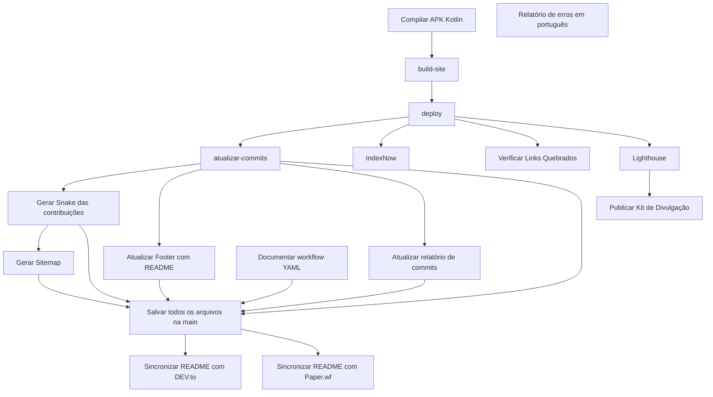

# Documentação do workflow — Mulher Amparada

Arquivo analisado: `.github/workflows/automations.yml`

Total de jobs identificados: **17**

## Fluxo de dependências

## Jobs identificados

### Compilar APK Kotlin

- **ID:** `build`
- **Runner:** `ubuntu-24.04`
- **Dependências:** nenhuma identificada

**Etapas:**

1. **relatorio-erros-portugues** — usa `actions/upload-artifact@v6`
2. **relatorio-erros-portugues** — usa `actions/upload-artifact@v6`
3. **relatorio-erros-portugues** — usa `actions/upload-artifact@v6`
4. **relatorio-erros-portugues** — usa `actions/upload-artifact@v6`
5. **relatorio-erros-portugues** — usa `actions/upload-artifact@v6`
6. **relatorio-erros-portugues** — usa `actions/upload-artifact@v6`
7. **relatorio-erros-portugues** — usa `actions/upload-artifact@v6`
8. **relatorio-erros-portugues** — usa `actions/upload-artifact@v6`
9. **relatorio-erros-portugues** — usa `actions/upload-artifact@v6`
10. **relatorio-erros-portugues** — usa `actions/upload-artifact@v6`
11. **relatorio-erros-portugues** — usa `actions/upload-artifact@v6`
12. **relatorio-erros-portugues** — usa `actions/upload-artifact@v6`
13. **relatorio-erros-portugues** — usa `actions/upload-artifact@v6`
14. **relatorio-erros-portugues** — usa `actions/upload-artifact@v6`
15. **relatorio-erros-portugues** — usa `actions/upload-artifact@v6`
16. **relatorio-erros-portugues** — usa `actions/upload-artifact@v6`
17. **relatorio-erros-portugues** — usa `actions/upload-artifact@v6`
18. **relatorio-erros-portugues** — usa `actions/upload-artifact@v6`
19. **relatorio-erros-portugues** — usa `actions/upload-artifact@v6`
20. **relatorio-erros-portugues** — usa `actions/upload-artifact@v6`

### build-site

- **ID:** `build-site`
- **Runner:** `ubuntu-24.04`
- **Dependências:** `build`

**Etapas:**

1. **relatorio-erros-portugues** — usa `actions/upload-artifact@v6`
2. **relatorio-erros-portugues** — usa `actions/upload-artifact@v6`
3. **relatorio-erros-portugues** — usa `actions/upload-artifact@v6`
4. **relatorio-erros-portugues** — usa `actions/upload-artifact@v6`

### deploy

- **ID:** `deploy`
- **Runner:** `ubuntu-24.04`
- **Dependências:** `build-site`

**Etapas:**

1. **relatorio-erros-portugues** — usa `actions/upload-artifact@v6`

### atualizar-commits

- **ID:** `atualizar-commits`
- **Runner:** `ubuntu-24.04`
- **Dependências:** `deploy`

**Etapas:**

1. **relatorio-erros-portugues** — usa `actions/upload-artifact@v6`
2. **relatorio-erros-portugues** — usa `actions/upload-artifact@v6`
3. **relatorio-erros-portugues** — usa `actions/upload-artifact@v6`

### Sincronizar README com DEV.to

- **ID:** `sincronizar-devto`
- **Runner:** `ubuntu-24.04`
- **Dependências:** `salvar-na-main`

**Etapas:**

1. **relatorio-erros-portugues** — usa `actions/upload-artifact@v6`
2. **relatorio-erros-portugues** — usa `actions/upload-artifact@v6`

### Sincronizar README com Paper.wf

- **ID:** `sincronizar-paperwf`
- **Runner:** `ubuntu-24.04`
- **Dependências:** `salvar-na-main`

**Etapas:**

1. **relatorio-erros-portugues** — usa `actions/upload-artifact@v6`
2. **relatorio-erros-portugues** — usa `actions/upload-artifact@v6`

### Gerar Sitemap

- **ID:** `sitemap`
- **Runner:** `ubuntu-24.04`
- **Dependências:** `snake`

**Etapas:**

1. **relatorio-erros-portugues** — usa `actions/upload-artifact@v6`
2. **relatorio-erros-portugues** — usa `actions/upload-artifact@v6`
3. **relatorio-erros-portugues** — usa `actions/upload-artifact@v6`

### IndexNow

- **ID:** `indexnow`
- **Runner:** `ubuntu-24.04`
- **Dependências:** `deploy`

**Etapas:**

1. **relatorio-erros-portugues** — usa `actions/upload-artifact@v6`

### Verificar Links Quebrados

- **ID:** `broken-links`
- **Runner:** `ubuntu-24.04`
- **Dependências:** `deploy`

**Etapas:**

1. **relatorio-erros-portugues** — usa `actions/upload-artifact@v6`

### Lighthouse

- **ID:** `lighthouse`
- **Runner:** `ubuntu-24.04`
- **Dependências:** `deploy`

**Etapas:**

1. **relatorio-erros-portugues** — usa `actions/upload-artifact@v6`

### Gerar Snake das contribuições

- **ID:** `snake`
- **Runner:** `ubuntu-24.04`
- **Dependências:** `atualizar-commits`

**Etapas:**

1. **relatorio-erros-portugues** — usa `actions/upload-artifact@v6`
2. **relatorio-erros-portugues** — usa `actions/upload-artifact@v6`
3. **relatorio-erros-portugues** — usa `actions/upload-artifact@v6`
4. **relatorio-erros-portugues** — usa `actions/upload-artifact@v6`

### Publicar Kit de Divulgação

- **ID:** `publicar-divulgacao`
- **Runner:** `ubuntu-24.04`
- **Dependências:** `lighthouse`

**Etapas:**

1. **relatorio-erros-portugues** — usa `actions/upload-artifact@v6`
2. **relatorio-erros-portugues** — usa `actions/upload-artifact@v6`
3. **relatorio-erros-portugues** — usa `actions/upload-artifact@v6`
4. **relatorio-erros-portugues** — usa `actions/upload-artifact@v6`

### Atualizar Footer com README

- **ID:** `atualizar-footer`
- **Runner:** `ubuntu-24.04`
- **Dependências:** `atualizar-commits`

**Etapas:**

1. **relatorio-erros-portugues** — usa `actions/upload-artifact@v6`
2. **relatorio-erros-portugues** — usa `actions/upload-artifact@v6`
3. **relatorio-erros-portugues** — usa `actions/upload-artifact@v6`
4. **relatorio-erros-portugues** — usa `actions/upload-artifact@v6`
5. **relatorio-erros-portugues** — usa `actions/upload-artifact@v6`

### Atualizar relatório de commits

- **ID:** `atualizar-relatorio-commits`
- **Runner:** `ubuntu-24.04`
- **Dependências:** `atualizar-commits`

**Etapas:**

1. **relatorio-erros-portugues** — usa `actions/upload-artifact@v6`
2. **relatorio-erros-portugues** — usa `actions/upload-artifact@v6`
3. **relatorio-erros-portugues** — usa `actions/upload-artifact@v6`
4. **relatorio-erros-portugues** — usa `actions/upload-artifact@v6`

### Documentar workflow YAML

- **ID:** `pesquisar-projeto`
- **Runner:** `ubuntu-24.04`
- **Dependências:** nenhuma identificada

**Etapas:**

1. **relatorio-erros-portugues** — usa `actions/upload-artifact@v6`
2. **relatorio-erros-portugues** — usa `actions/upload-artifact@v6`
3. **relatorio-erros-portugues** — usa `actions/upload-artifact@v6`
4. **relatorio-erros-portugues** — usa `actions/upload-artifact@v6`

### Salvar todos os arquivos na main

- **ID:** `salvar-na-main`
- **Runner:** `ubuntu-24.04`
- **Dependências:** `atualizar-commits`, `snake`, `sitemap`, `atualizar-footer`, `atualizar-relatorio-commits`, `pesquisar-projeto`

**Etapas:**

1. **relatorio-erros-portugues** — usa `actions/upload-artifact@v6`
2. **relatorio-erros-portugues** — usa `actions/upload-artifact@v6`
3. **relatorio-erros-portugues** — usa `actions/upload-artifact@v6`
4. **relatorio-erros-portugues** — usa `actions/upload-artifact@v6`
5. **relatorio-erros-portugues** — usa `actions/upload-artifact@v6`
6. **relatorio-erros-portugues** — usa `actions/upload-artifact@v6`
7. **relatorio-erros-portugues** — usa `actions/upload-artifact@v6`
8. **relatorio-erros-portugues** — usa `actions/upload-artifact@v6`
9. **relatorio-erros-portugues** — usa `actions/upload-artifact@v6`

### Relatório de erros em português

- **ID:** `relatorio-erros`
- **Runner:** `ubuntu-24.04`
- **Dependências:** nenhuma identificada

**Etapas:**

1. **relatorio-erros-portugues** — usa `actions/upload-artifact@v6`
2. **relatorio-erros-portugues** — usa `actions/upload-artifact@v6`
3. **relatorio-erros-portugues** — usa `actions/upload-artifact@v6`
4. **relatorio-erros-portugues** — usa `actions/upload-artifact@v6`
5. **relatorio-erros-portugues** — usa `actions/upload-artifact@v6`

